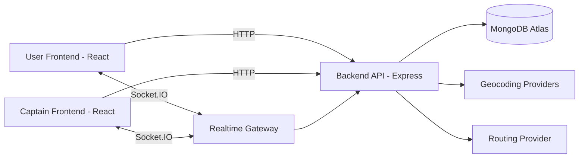

# Uber Clone - Full Stack Ride Booking Platform

<p align="center">
  <a href="#"></a>
  <a href="#"></a>
  <a href="#"></a>
</p>

<p align="center">
  <a href="https://uber-clone-eight-phi.vercel.app/" target="_blank">
    
  </a>
</p>

<p align="center">
  
  
  
  
  
  
  
  
  
  
</p>

## Overview
This project is a complete Uber-style ride booking application built with a modern full stack architecture.

It supports:
- User and Captain authentication
- Location search and route-based fare estimation
- Ride request creation and matching
- Real-time ride lifecycle updates using Socket.IO
- Live tracking map experience using free map providers

The system is designed to work both in local development and in cloud deployment environments.

## Live Demo
### Production URL
- https://uber-clone-eight-phi.vercel.app/

### App Preview

<p align="center">
  <a href="https://uber-clone-eight-phi.vercel.app/" target="_blank">
    
  </a>
</p>

## Core Business Flow
### User Journey
1. User logs in and lands on Home.
2. User enters pickup and destination using autocomplete suggestions.
3. User fetches fare options for vehicle categories.
4. User chooses vehicle and confirms ride.
5. User receives real-time updates:
- Ride confirmed
- Ride started
- Ride ended

### Captain Journey
1. Captain logs in and joins real-time socket channel.
2. Captain periodically sends current location.
3. Captain receives nearby ride request event.
4. Captain accepts ride and verifies OTP to start trip.
5. Captain ends ride and user is notified in real-time.

## Realtime Event Integration (Socket.IO)
### Client -> Server
- join
- update-location-captain

### Server -> Client
- new-ride
- ride-confirmed
- ride-started
- ride-ended

This event-driven layer keeps user and captain UI synchronized without polling.

## Location, Suggestions, and Fare Engine
The project uses free geocoding and routing strategy with resilience for production traffic:

- Autocomplete provider aggregation
- In-memory suggestion cache and prefix reuse
- Coordinate-aware fare computation path
- Route-time/distance fallback estimation if external router is unavailable

This avoids hard failures during external rate-limits and keeps ride flow operational.

## Features Matrix
- User Signup/Login/Profile/Logout
- Captain Signup/Login/Profile/Logout
- Protected route middleware for User and Captain
- JWT authentication with token blacklist support
- Address autocomplete suggestions
- Distance and duration estimation
- Dynamic fare calculation per vehicle type
- Ride creation, confirmation, start, and completion
- Real-time status sync via Socket.IO
- Captain location update channel
- Responsive bottom-sheet UX for mobile ride flow
- Free-map based live tracking experience

## System Architecture
## High-Level Diagram


## Project Structure
```text
Project-3 (Uber)
|- Backend
|  |- app.js
|  |- server.js
|  |- routes/
|  |- controllers/
|  |- services/
|  |- models/
|  |- middlewares/
|  |- README.md
|
|- frontend
|  |- src/
|  |  |- pages/
|  |  |- components/
|  |  |- context/
|  |- vercel.json
|  |- README.md
```

## API Surface (Major Groups)
### User APIs
- POST /api/users/register
- POST /api/users/login
- GET /api/users/profile
- GET /api/users/logout

### Captain APIs
- POST /api/captains/register
- POST /api/captains/login
- GET /api/captains/profile
- GET /api/captains/logout

### Maps APIs
- GET /api/maps/get-coordinates
- GET /api/maps/get-distance-time
- GET /api/maps/get-suggestions

### Ride APIs
- POST /api/rides/create
- GET /api/rides/get-fare
- POST /api/rides/confirm
- GET /api/rides/start-ride
- POST /api/rides/end-ride

Detailed request/response examples are maintained inside:
- Backend/README.md

## Security and Validation
- Input validation via express-validator
- Password hashing via bcrypt
- JWT signing and verification
- Token blacklist strategy for logout invalidation
- Auth middleware separation for user and captain

## Local Development Setup
### Prerequisites
- Node.js 18+
- MongoDB Atlas database

### 1) Backend setup
```bash
cd Backend
npm install
```

Create Backend/.env:
```env
PORT=3000
MONGO_URI=your_mongodb_connection_string
JWT_SECRET=your_jwt_secret
GEOAPIFY_API_KEY=your_geoapify_api_key
```

Run backend:
```bash
npm run dev
```

### 2) Frontend setup
```bash
cd frontend
npm install
```

Create frontend/.env:
```env
VITE_BASE_URL=http://localhost:3000/
```

Run frontend:
```bash
npm run dev
```

## Production Deployment Guide
### Recommended Free Stack
- Frontend: Vercel
- Backend: Render Web Service
- Database: MongoDB Atlas Free Tier

### Frontend on Vercel
- Root Directory: frontend
- Build Command: npm run build
- Output Directory: dist
- Env: VITE_BASE_URL=https://your-backend.onrender.com/

SPA routing rewrite is configured in:
- frontend/vercel.json

### Backend on Render
- Root Directory: Backend
- Build Command: npm install
- Start Command: npm start
- Required env vars:
- MONGO_URI
- JWT_SECRET
- GEOAPIFY_API_KEY

## Reliability Notes
- Production geocoding/routing providers may return rate-limit or transient network failures.
- The app includes fallback and caching strategies to keep ride flow usable.
- For enterprise reliability, move to paid dedicated geocoding/routing APIs or self-hosted routing infrastructure.

## Engineering Highlights
- Clear layering: routes -> controllers -> services -> models
- Realtime and REST are decoupled but integrated by business events
- Cloud-ready env-driven config
- Mobile-first panel UX with staged ride states

## Future Improvements
- Observability dashboard for provider health and rate-limit metrics
- Persistent Redis cache for geocoding/suggestions
- Multi-region deployment
- Better geo-indexing and captain matching strategy
- Notifications and trip history analytics

## License
This project is for educational and portfolio use.
